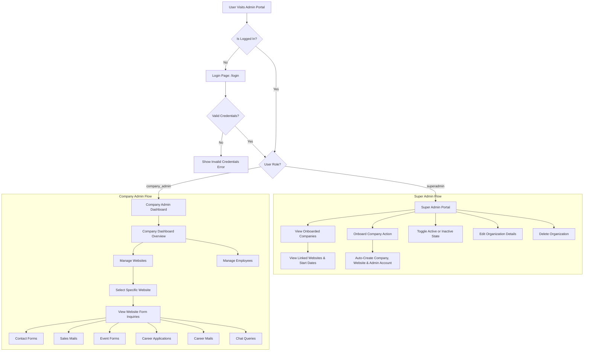

# System Architecture, Flowchart & API Documentation

## 1. Executive Summary

The **Humantech Admin Panel** is a multi-tenant enterprise management platform built using **Next.js (App Router)** for the frontend and **Node.js / Express / MongoDB** for the backend.

The platform operates on a two-tier permission model:
* **Product Owner / Super Admin:** Global platform oversight, managing onboarded organizations, storage capacity, global website lists, and system-wide metric tracking.
* **Company Admin (Tenant Admin):** Isolated organization access, managing company employees, linked websites, and form submission leads (*Contact Forms*, *Sales Mails*, *Career Applications*, *Event Forms*, *Chat Queries*).

---

## 2. System Architecture Flowcharts

### 2.1 Universal Visual ASCII Flowchart

```text
┌──────────────────────────────────────────────────────────────────────────────────┐
│                             USER VISITS ADMIN PORTAL                             │
└────────────────────────────────────────┬─────────────────────────────────────────┘
                                         │
                                 ┌───────┴───────┐
                                 │ Is Logged In? │
                                 └───────┬───────┘
                         NO              │              YES
                 ┌───────────────────────┴───────────────┐
                 ▼                                       ▼
       ┌──────────────────┐                    ┌──────────────────┐
       │   /login Page    │                    │ Check User Role  │
       └────────┬─────────┘                    └─────────┬────────┘
                │ Valid Password                         │
                └────────────────────────────────────────┤
                                                         │
                ┌────────────────────────────────────────┴────────────────────────────────────────┐
                ▼                                                                                 ▼
 ┌──────────────────────────────┐                                                  ┌──────────────────────────────┐
 │ Super Admin / Product Owner  │                                                  │     Company Tenant Admin     │
 │   /organization/companies    │                                                  │       /admin/dashboard       │
 └──────────────┬───────────────┘                                                  └──────────────┬───────────────┘
                │                                                                                 │
 ┌──────────────┴──────────────┐                                                   ┌──────────────┴──────────────┐
 ▼                             ▼                                                   ▼                             ▼
Onboard Company       Linked Websites                                        Manage Websites            View Form Inquiries
(+ Primary Site)     (Subheadings & Dates)                                  (& CRM Webhooks)            (Contact, Sales, Career)
```

---

### 2.2 Organization Onboarding & Auto-Provisioning ASCII Flow

```text
SUPER ADMIN                 FRONTEND (/organization)            EXPRESS BACKEND                   MONGODB DATABASE
    │                                  │                               │                                 │
    ├─── 1. Fill Onboard Form ─────────►                               │                                 │
    │    (Name, Email, Site URL)       │                               │                                 │
    │                                  ├─── 2. POST /api/companies/add ─►                               │
    │                                  │    (with Bearer Token)        │                                 │
    │                                  │                               ├─── 3. Check unique slug ───────►
    │                                  │                               ├─── 4. Save Company document ───►
    │                                  │                               ├─── 5. Save Website document ───►
    │                                  │                               ├─── 6. Create Admin User ───────►
    │                                  │                               │                                 │
    │                                  │                               ├─── 7. Send Welcome Email ──────► [SMTP]
    │                                  │                               │                                 │
    │                                  │◄── 8. Return JSON Response ───┤                                 │
    │                                  │    ({ success: true })        │                                 │
    │◄── 9. Table Refreshes ───────────┤                               │                                 │
    │    via useCompanies()            │                               │                                 │
```

---

### 2.3 Mermaid Flowchart Diagram



---

## 3. Complete API Reference & Payload Documentation

All backend API requests require authentication via a JWT token passed in the Authorization header:
```http
Authorization: Bearer <sessionStorageToken>
Content-Type: application/json
```

---

### 3.1 Company Management APIs

#### 1. Get All Companies (with Linked Websites & Start Dates)
* **Endpoint:** `GET /api/companies/all`
* **Access:** Super Admin
* **Description:** Retrieves all onboarded tenant organizations, populated with their linked website records.

##### Response Payload (`200 OK`):
```json
{
  "success": true,
  "count": 2,
  "companies": [
    {
      "_id": "66c0e812a4b8901234567890",
      "name": "Justice League",
      "slug": "justice-league",
      "description": "Global enterprise security & tech operations",
      "adminEmail": "admin@justiceleague.com",
      "fromEmailName": "Justice League System",
      "isActive": true,
      "createdAt": "2026-08-17T10:00:00.000Z",
      "websites": [
        {
          "_id": "6a858e017a20b53c1288cb2f",
          "name": "Kryptonite Ice Cream",
          "slug": "kryptonite-icecream",
          "url": "https://kryptonite-icecream.com",
          "companyId": "66c0e812a4b8901234567890",
          "isActive": true,
          "createdAt": "2026-08-18T14:30:00.000Z"
        }
      ]
    }
  ]
}
```

---

#### 2. Onboard New Company
* **Endpoint:** `POST /api/companies/add`
* **Access:** Super Admin
* **Description:** Onboards a company, provisions its primary website, and creates a company admin account with email credentials.

##### Request Payload:
```json
{
  "name": "Acme Corp",
  "slug": "acme-corp",
  "description": "Manufacturing & distribution",
  "adminEmail": "admin@acme.com",
  "fromEmailName": "Acme Notifications",
  "siteUrl": "https://acme.com",
  "siteName": "Acme Main Store"
}
```

##### Response Payload (`201 Created`):
```json
{
  "success": true,
  "message": "Company created successfully",
  "company": {
    "_id": "66c0f999a4b8901234567891",
    "name": "Acme Corp",
    "slug": "acme-corp",
    "description": "Manufacturing & distribution",
    "adminEmail": "admin@acme.com",
    "fromEmailName": "Acme Notifications",
    "isActive": true,
    "createdAt": "2026-08-20T10:30:00.000Z"
  },
  "website": {
    "_id": "6a859f007a20b53c1288cb30",
    "name": "Acme Main Store",
    "slug": "acme-main-store",
    "url": "https://acme.com",
    "companyId": "66c0f999a4b8901234567891",
    "isActive": true,
    "createdAt": "2026-08-20T10:30:00.000Z"
  },
  "tempPassword": "Pass#a1b2c3d4!"
}
```

---

#### 3. Update Company Details / Toggle Active Status
* **Endpoint:** `PUT /api/companies/:id`
* **Access:** Super Admin

##### Request Payload:
```json
{
  "name": "Acme Global Corp",
  "isActive": false
}
```

##### Response Payload (`200 OK`):
```json
{
  "success": true,
  "message": "Company updated successfully",
  "company": {
    "_id": "66c0f999a4b8901234567891",
    "name": "Acme Global Corp",
    "slug": "acme-corp",
    "isActive": false
  }
}
```

---

#### 4. Delete Company
* **Endpoint:** `DELETE /api/companies/:id`
* **Access:** Super Admin

##### Response Payload (`200 OK`):
```json
{
  "success": true,
  "message": "Company deleted successfully"
}
```

---

### 3.2 Website Management APIs

#### 1. Fetch Websites for a Specific Company
* **Endpoint:** `GET /api/companies/:companyId/websites`
* **Access:** Super Admin / Company Admin

##### Response Payload (`200 OK`):
```json
{
  "success": true,
  "count": 1,
  "websites": [
    {
      "_id": "6a858e017a20b53c1288cb2f",
      "companyId": "66c0e812a4b8901234567890",
      "name": "Kryptonite Ice Cream",
      "slug": "kryptonite-icecream",
      "url": "https://kryptonite-icecream.com",
      "crmType": "custom",
      "crmConfig": {
        "endpoint": "https://api.kryptonite.com/v1/leads",
        "apiKey": "key_sec_99201"
      },
      "isActive": true,
      "createdAt": "2026-08-18T14:30:00.000Z"
    }
  ]
}
```

---

#### 2. Create Website for a Company
* **Endpoint:** `POST /api/companies/:companyId/websites`
* **Access:** Company Admin

##### Request Payload:
```json
{
  "name": "Kryptonite Landing Page",
  "url": "https://landing.kryptonite-icecream.com",
  "crmType": "hubspot",
  "crmConfig": {
    "endpoint": "https://api.hubapi.com/crm/v3/objects/contacts",
    "apiKey": "pat-eu1-xxxx"
  }
}
```

---

### 3.3 Form Submission & Inquiry APIs

Filter inquiries by appending `company` (slug or ID) and `website` (ID or slug) query parameters:

| Module | Endpoint URL | Description |
| :--- | :--- | :--- |
| **Contact Forms** | `GET /api/contact-form?company={slug}&website={websiteId}` | Contact inquiries & category logs |
| **Sales Mails** | `GET /api/sales-mails?company={slug}&website={websiteId}` | Direct sales lead emails |
| **Career Applications** | `GET /api/career?company={slug}&website={websiteId}` | Job application submissions & resumes |
| **Career Mails** | `GET /api/career-mails?company={slug}&website={websiteId}` | Career inquiry messages |
| **Event Registrations**| `GET /api/event-form?company={slug}&website={websiteId}` | Event signups & attendee logs |
| **Chat Queries** | `GET /api/chat-queries?company={slug}&website={websiteId}` | Live chatbot conversation logs |

---

## 4. MongoDB Database Schemas

### 4.1 Company Schema (`models/companyModel.js`)

```javascript
const companySchema = new mongoose.Schema({
  name: { type: String, required: true, trim: true },
  slug: { type: String, required: true, unique: true, lowercase: true, trim: true },
  description: { type: String, trim: true },
  adminEmail: { type: String, required: true, lowercase: true, trim: true },
  fromEmailName: { type: String, trim: true },
  isActive: { type: Boolean, default: true },
}, { timestamps: true });
```

---

### 4.2 Website Schema (`models/websiteModel.js`)

```javascript
const websiteSchema = new mongoose.Schema({
  name: { type: String, required: true, trim: true },
  slug: { type: String, required: true, unique: true, lowercase: true, trim: true },
  url: { type: String, trim: true },
  companyId: { type: mongoose.Schema.Types.ObjectId, ref: 'Company', required: true },
  crmType: { type: String, default: 'custom' },
  crmConfig: { type: mongoose.Schema.Types.Mixed, default: {} },
  isActive: { type: Boolean, default: true },
}, { timestamps: true });
```

---

## 5. Summary of Frontend Route Structure

```text
src/app/
├── login/
│   └── page.tsx                     # Authentication Page
├── organization/
│   └── companies/
│       └── page.tsx                 # Super Admin Master Portal
└── admin/
    └── dashboard/
        ├── page.tsx                 # Main Company Admin Overview
        ├── websites/
        │   ├── page.tsx             # Websites Entry Page
        │   └── WebsitesClient.tsx   # Website List & Submissions Link Component
        ├── contact-form/            # Contact Form Submissions Viewer
        ├── sales-mails/             # Sales Emails Viewer
        ├── event-form/              # Event Registrations Viewer
        ├── career/                  # Career Applications Viewer
        ├── career-mails/            # Career Email Inquiries Viewer
        └── chat-queries/            # Chatbot Conversation Logs Viewer
```
